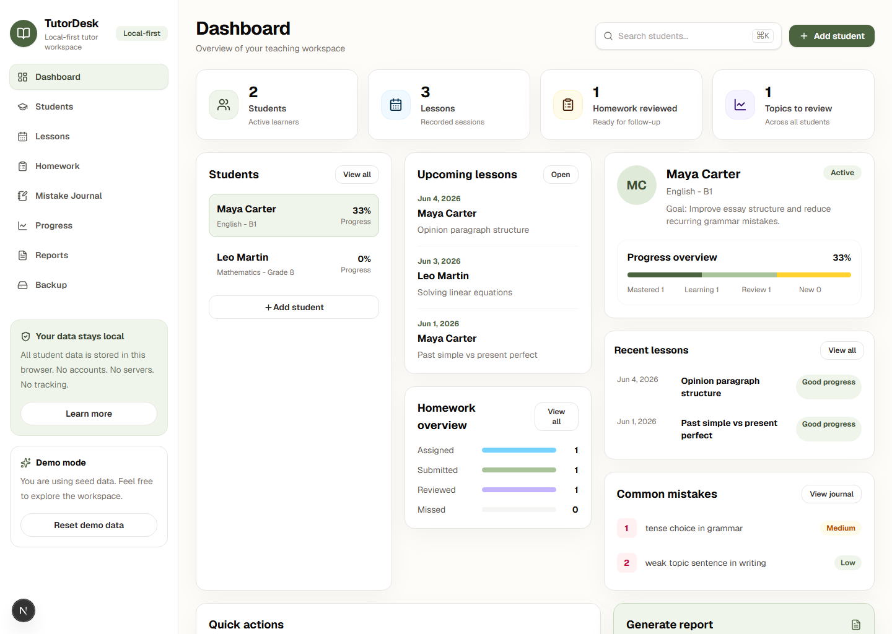
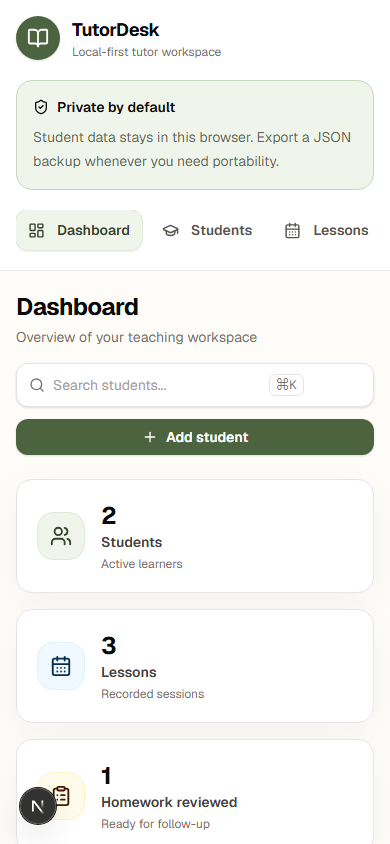

# TutorDesk

TutorDesk is a local-first open-source workspace for private tutors and small educators. It helps tutors track students, lessons, homework, recurring mistakes, learning progress, and simple Markdown progress reports without sending student data to third-party servers.

> MVP status: functional local-first prototype with demo data, browser storage, import/export, and tests.
>
> TutorDesk is usable as an MVP today and is still actively evolving. The next releases focus on storage durability, editing workflows, and report templates.

## Screenshots



Mobile layout:



## Why TutorDesk

Tutors often keep student progress across notebooks, chat messages, spreadsheets, and memory. TutorDesk gives them one calm workspace for the teaching loop:

- who the student is
- what happened in lessons
- what homework was assigned
- which mistakes repeat
- what topics need review
- what to tell the student or parent next

The MVP is intentionally local-first. Student data stays in the browser unless the tutor exports a JSON backup.

## Features

- Student profiles with subject, level, goals, and notes
- Lesson records with date, topic, summary, materials, and tutor notes
- Homework tracking with assigned, submitted, reviewed, and missed states
- Mistake journal for recurring issues, examples, corrections, and severity
- Mistake frequency by topic
- Topic progress states: not started, learning, needs review, mastered
- Markdown progress report generation
- Copy-to-clipboard report action
- JSON export and import
- Demo seed data
- Responsive teacher-friendly interface

## Tech Stack

- Next.js App Router
- TypeScript
- Tailwind CSS
- React Hook Form
- Zod
- localStorage for the MVP local-first layer
- Vitest

## Quick Start

```bash
npm install
npm run dev
```

Open `http://localhost:3000`.

## Scripts

```bash
npm run dev
npm run lint
npm test
npm run build
npm run qa:functional
```

`npm run qa:functional` expects the app to be running at `http://127.0.0.1:3000`. You can override this with `TUTORDESK_URL`.

## Data Model

TutorDesk stores a single local JSON document:

- `students`
- `lessons`
- `homework`
- `mistakes`
- `progress`

The current storage layer uses `localStorage` for MVP simplicity. The next storage milestone is IndexedDB for larger workspaces and safer backup flows.

## Roadmap

See [ROADMAP.md](ROADMAP.md) for the release plan.

- [ ] IndexedDB storage adapter
- [ ] Edit and delete controls for every record type
- [ ] Search and filters across students and notes
- [ ] Report templates
- [ ] Screenshot-backed README
- [ ] Import validation preview before applying a backup
- [ ] Optional Playwright smoke tests
- [ ] Offline/PWA support

## Contributing

TutorDesk is early and intentionally small. Product feedback, accessibility improvements, UI polish, and local-first data ideas are welcome.

Read [CONTRIBUTING.md](CONTRIBUTING.md) before opening a pull request.

## License

MIT. See [LICENSE](LICENSE).
